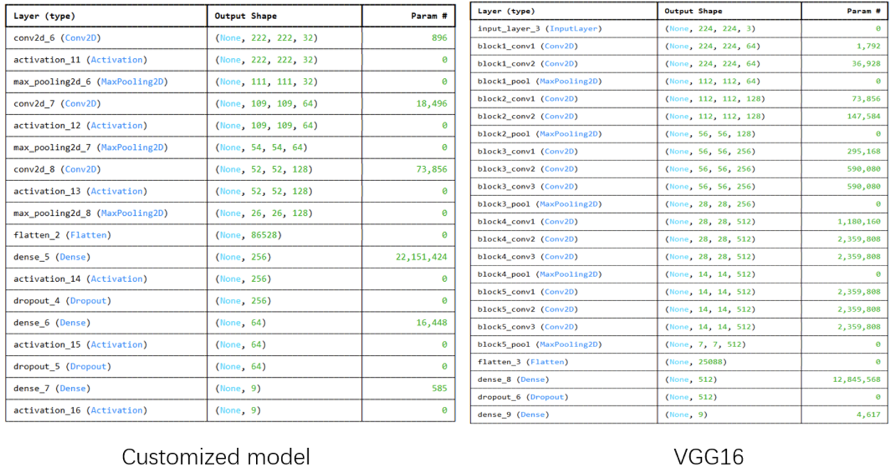

```{r setup, include=FALSE}
knitr::opts_chunk$set(tidy.opts = list(width.cutoff = 60), tidy = TRUE)
```

# 1. Introduction

Waste disposal is a major challenge in environmental management, which is largely because classifying different types of waste can be quite complicated. Traditional sorting methods usually simplify waste into just landfill or recyclable categories, which can miss important details about specific types, like organic materials and hazardous substances. In our project, we aim to improve waste classification by developing a new convolutional neural network (CNN) model using the RealWaste dataset. This approach not only improves accuracy but also helps with better resource recovery and raises public awareness about effective waste management.

We built our CNN model using the Keras library and took advantage of its powerful features for extracting and classifying data. By comparing the performance of our custom model with the well-known VGG16 model, we hope to show how deep learning techniques can significantly improve waste classification and contribute to more sustainable waste management practices.

# 2. Related Works

The use of machine learning algorithms for waste classification has been around for quite some time, and recent use in deep learning have significantly boosted performance and accuracy. Here are some key studies that highlight how well CNNs work for this purpose:
    
* Sakr et al. (2016) collected 2,000 images using a Raspberry Pi 3, focusing on three categories: plastic, paper, and metal. They applied a Support Vector Machine (SVM) with a non-linear kernel and achieved an impressive test accuracy of 94.8%, with the paper category reaching a 99% accuracy. But authors still favor CNN because it will reduce the effect of overfitting that was observed in their study. 

* Single et al. (2023) introduced the RealWaste dataset, which includes 4,808 images from Australian landfills sorted into nine different waste categories. Their evaluation of five CNN models showed accuracies above 85%, with Inception V3 performing the best at 89.19%. This dataset provides a solid foundation for our project’s waste classification efforts using deep learning.

* In Narayan's (2021) DeepWaste project, a mobile app was developed that uses deep learning to classify waste in real time as trash, recycling, or compost. Their best model—a 50-layer residual neural network—achieved an average precision of 0.881.

These publications show the effectiveness of deep learning techniques for waste classification and offer practical examples that match well with our project goals.

# 3. Dataset

The RealWaste dataset (Single et al., 2023) includes 4,808 images collected from the Whyte's Gully Waste and Resource Recovery Centre in Wollongong, New South Wales, Australia. This dataset is organized into nine distinct waste categories: cardboard (461 images), food organics (411), glass (420), metal (790), miscellaneous trash (495), paper (500), plastic (921), textile trash (318), and vegetation (436). The dataset addresses the limitations of previous collections, which often lacked comprehensive categorization, by incorporating a diverse range of waste types. The comprehensiveness reflects the complexity of real-world waste management scenarios where various materials are often intermixed. The images are captured at a resolution of 524 × 524 pixels, ensuring that fine details are preserved for effective analysis and feature extraction in machine learning algorithms. 

For our project, we used 90% of the dataset for training our convolutional neural network (CNN) model and reserved the remaining 10% for testing its performance. This allowed us to train the model on a large amount of data while also ensuring we could test on unseen samples. The RealWaste dataset is a valuable resource that advances waste classification research through deep learning techniques across multiple projects.


# 4. Methods 

In this study, the aim is to design a new  convolutional neural network (CNN) model train and test it using the RealWaste Dataset and then compare the model to the performance of the exist VGG16 model, use the better to predict some photo of wastes from real life.

For the customized model, we utilized the Keras library, a high-level neural network API running on top of TensorFlow to implement a convolutional neural network for feature extraction and classification. The Sequential model from Keras was used to define the architecture, with essential layers such as Conv2D for convolution operations, BatchNormalization for stabilizing and accelerating training, and MaxPooling2D for dimensionality reduction. The model also incorporated Activation layers with the ReLU function to introduce non-linearity, Dropout layers to mitigate overfitting, and Flatten and Dense layers for feature transformation and final classification, respectively. This combination of layers was chosen to efficiently process the input data and achieve robust performance on the target task.

The customized model has one input layer, three convolutional layers and three fully connected (dense) layers. You can see the model summary in table 1. The first convolutional layer uses 32 filters with a kernel size of 3 × 3, while the subsequent layers increase the filter count to 64 and 128, respectively. These layers are responsible for learning spatial hierarchies of features, such as edges, textures, and patterns. The trainable parameters in these layers are 896, 18,496, and 73,856, respectively.Following each convolutional layer, ReLU (Rectified Linear Unit) activation functions are applied to introduce non-linearity into the model. These layers do not contain trainable parameters. Pooling layers are used after each convolutional block, which can effectively down-sampling the feature maps. They also do not contain trainable parameters.After the final convolutional and pooling layers, the feature maps are flattened into a one-dimensional vector with 86,528 elements. This transformation prepares the data for input into fully connected layers. There are 3 fully connected layers and 2 dropout layers in the model.The first dense layer has 256 neurons with 22,151,424 trainable parameters, followed by a drop layer. The second dense layer has 64 neurons and 16,448 trainable parameters also followed  by a dropout layer. The final dense layer used for classification has 9 neurons corresponding to the 9 target classes, with 585 trainable parameters. The epoch is set as 25 after balancing the accuracy and loss, which means the training dataset has been passed through the model 25 times during the training process.

For the VGG16 model,we import the model from the tensorflow.keras.applications. The VGG16 model is  pre-trained on the ImageNet dataset and is important  for transfer learning by providing a robust feature extraction base.

The model based on the VGG16  includes one input layer, five convolutional blocks, and two fully connected layers, as shown in Table 1. The first and second  convolutional blocks each consist of 2 convolutional layers, and the rest blocks each  have 3 convolutional layers. The number of filters are 64, 128, 256, 512, 512 in each block. The trainable parameters in each  convolutional  layer are 1792, 36928, 73856, 147584, 295168, 590080, 590080, 1180160, 2359808, 2359808, 2359808, 2359808, 2359808 respectively. Max pooling layers follow each block to down-sample feature maps, and ReLU activation functions introduce non-linearity.The output of the final convolutional block is flattened into a 25,088-dimensional vector for the dense layers. The first fully connected layer has 512 neurons, with 12845568 trainable parameters, followed by dropout layers for regularization. The final dense layer, used for classification, has 9 neurons and 4,617 trainable parameters. 

```{r, echo=FALSE, fig.align="center", out.width="95%", fig.cap="Table1  model summary for Customized model and VGG16"}

# knitr::include_graphics("/Users/xinjinli/Desktop/625 Report/model_structure.png")
```


# 5. Results

## Custom CNN Model:

* Accuracy: The custom model achieved a training accuracy of 63.48% and a validation accuracy of 66.39% after 25 epochs. The model showed effective learning over epochs as the accuracy continuously increased with some minor fluctuations.
* Loss: Both training and validation loss gradually decreased, stabilizing around 1.0 at the end of training. The validation loss (0.988) was slightly lower than the training loss (1.0395) which indicates that the model was not overfitting. This was consistent over most of the epochs.

## VGG16 Model:

* Accuracy: The fine-tuned VGG16 model achieved a higher training accuracy of approximately 75.32% and a validation accuracy of 73.7% after 14 epochs. The model was able to converge quickly in the first few epochs after which learning plateaued. As a result there was no considerable improvement in accuracy towards the end of the training process. 
* Loss: The VGG16 model showed a significant drop in training and validation loss early on, decreasing to well below our custom CNN’s best performance after only 4 epochs. The model achieved a final training loss of 0.69 and a validation loss of 0.73

# 6. Conclusion

The VGG16 model outperformed the custom CNN model in terms of accuracy and loss, achieving faster convergence and better generalization on the validation set. This also highlights the benefits of using fine-tuned pre-trained models to achieve high performance metrics in niche use cases. While the custom model displayed steady improvement, it required more epochs and exhibited slightly lower performance compared to the VGG16 model.

Overall, this study demonstrates the effectiveness of using deep learning models to achieve high performance in relevant waste management practices. By improving waste classification accuracy, these models can play a crucial role in many practical applications like effective recycling, and efficient resource recovery. Future work could explore using ensemble models to further improve performance by combining strong points of different algorithms and model architectures. Furthermore, with the advent of AI, using Vision Transformers would likely increase the accuracy of these models.


# 7. Discussion

The model we trained only reached roughly 66% validation accuracy. Though this a significant improvement over mere guessing for a 9-classification problem, which is evidence of sophistication of the algorithm, it is still relatively low to be useful for real-world application. For example, the imported VGG16 model achieved a notably better validation accuracy of about 74%. Furthermore, compared to similar classification problems in the literature, which have reached 85 - 99% accuracy (see Related Works), our CNN model has room for improvement. There are two constraints that, if remedied, could yield a much more accurate model using the same approach.

First, we were limited by the size of the dataset. The RealWaste dataset contains 4,808 images; if we had access to more training data, then we would likely be able to train a more accurate model. However, note that other models using the same quantity of data or less have achieved greater accuracy. For example, Single et al. (2023) used the same RealWaste dataset and achieved over 85% accuracy for each model. Moreover, Sakr et al. (2016) used just 2,000 images and achieved nearly 95% accuracy (overfitting concerns aside). 

Another perhaps more debilitating constraint for our model is computational power. The model fitting took place entirely on a local PC environment, without the use of supercomputing servers. Because of this, there was a limit to the complexity of the model and the number of parameters used. With access to more processing power, we could use the same dataset to train a more complex, and thus more accurate, model.
    
# References
1. Narayan, Y. (2021, January 15). DeepWaste: Applying deep learning to waste classification for a Sustainable planet. arXiv.org. https://arxiv.org/abs/2101.05960
2. Sakr, G. E., Mokbel, M., Darwich, A., Khneisser, M. N., & Hadi, A. (2016). Comparing deep learning and support vector machines for autonomous waste sorting. IEEE, 207–212. https://doi.org/10.1109/imcet.2016.7777453
3. Sakr, G. E., Mokbel, M., Darwich, A., Khneisser, M. N., & Hadi, A. (2016). Comparing deep learning and support vector machines for autonomous waste sorting. IEEE, 207–212. https://doi.org/10.1109/imcet.2016.7777453
4. Trends in solid waste management. (n.d.). https://datatopics.worldbank.org/what-a-waste/trends_in_solid_waste_management.html

